# SafeSnap Extension - Feature Demonstration

This document demonstrates SafeSnap's capabilities through real-world scenarios captured by our E2E test suite. Each scenario shows how SafeSnap automatically detects and protects different types of Personally Identifiable Information (PII) in screenshots.

All screenshots in this document are generated automatically by running:

```bash
bunx playwright test test/e2e/scenarios.spec.js
```

---

## Table of Contents

1. [Scenario 1: Real Estate Listing (Zillow)](#scenario-1-real-estate-listing-zillow)
2. [Scenario 2: Tax Calculator (Calculator.net)](#scenario-2-tax-calculator-calculatornet)
3. [Scenario 3: News Article (SFGate)](#scenario-3-news-article-sfgate)
4. [Scenario 4: Wikipedia Article (Blackout Mode)](#scenario-4-wikipedia-article-blackout-mode)

> **Note:** These screenshots are generated by the E2E test suite. See [TESTING.md](../TESTING.md#e2e-screenshot-scenarios) for how to regenerate them.

---

## Scenario 1: Real Estate Listing (Zillow)

**Use Case:** Sharing property listings without exposing exact addresses, prices, or agent information.

**Source:** [Zillow - 479 Kentucky Ave, Berkeley, CA](https://www.zillow.com/homedetails/479-Kentucky-Ave-Berkeley-CA-94707/24847894_zpid/)

### Detection Summary

| PII Type     | Count   | Examples                                                                         |
| ------------ | ------- | -------------------------------------------------------------------------------- |
| Money        | 137     | `$1,399,000` → `$194,808`, `$8,512` → `$1,185`                                   |
| Addresses    | 17      | `1141 Oxford St` → `5701 Second Ave`, `2728 Dohr St` → `613 Hill Ct`             |
| Locations    | 61      | `Kentucky` → `Unionville`, `Berkeley` → `Clearview`, `California` → `Harborview` |
| Dates        | 74      | Year references, listing dates                                                   |
| Proper Nouns | 375     | Agent names, company names                                                       |
| **Total**    | **664** |                                                                                  |

### Screenshots

#### Original (Before SafeSnap)

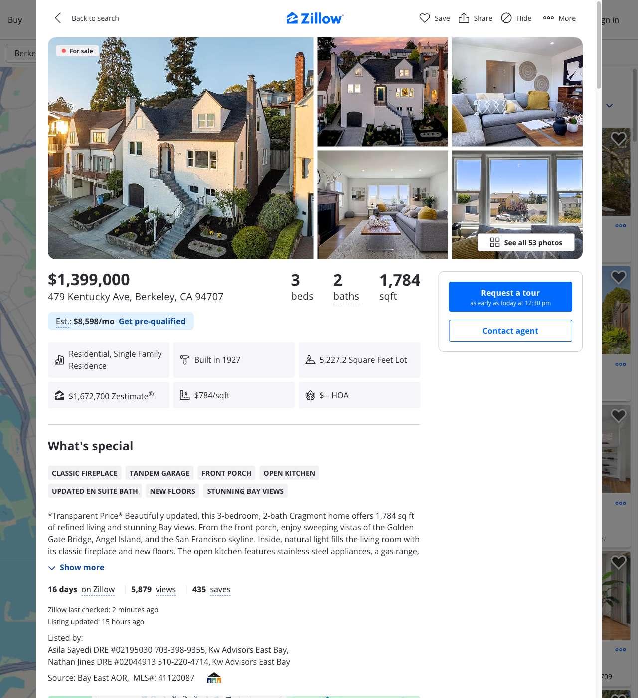

**Privacy Risks:**

- Property address fully visible
- Exact listing price exposed ($1,399,000)
- Tax assessment amounts shown ($8,512/year)
- Nearby property addresses visible
- Agent names and contact information exposed
- Zestimate history reveals property value trends

#### Highlighted (PII Detected)

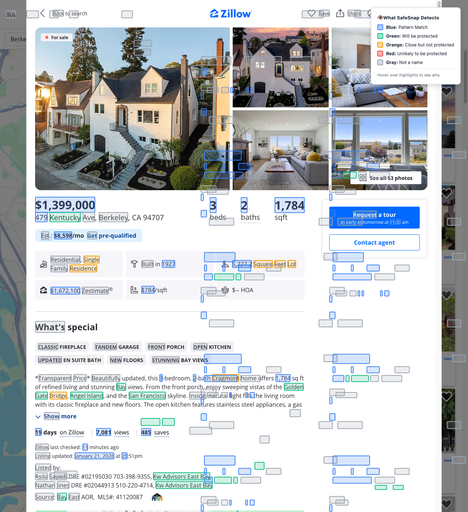

**Detection Applied:**

- Yellow highlights show all detected PII
- Hover tooltips show detection type and confidence
- 664 total PII entities identified

#### Protected (PII Replaced)

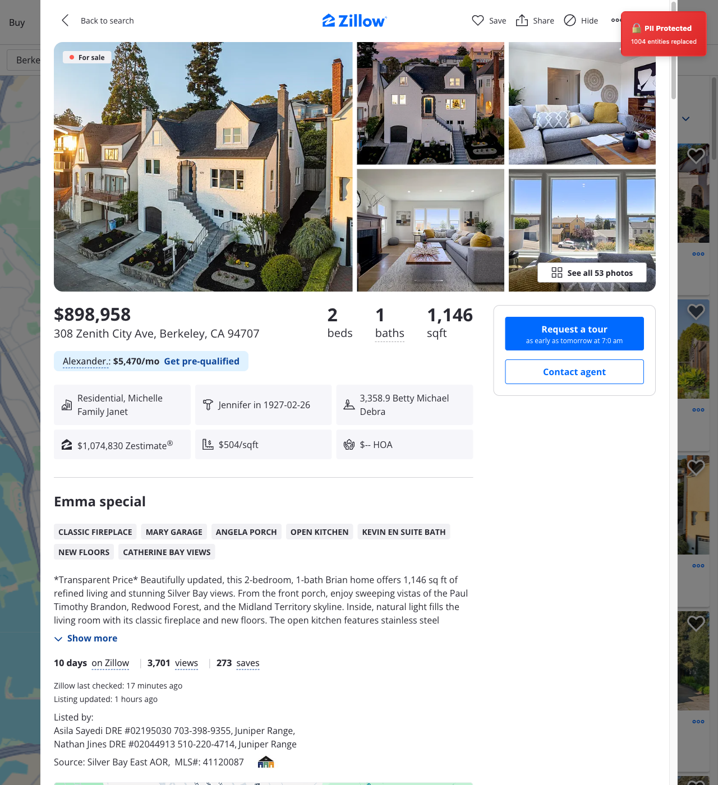

**Protection Applied:**

- All prices replaced with realistic values (magnitude variance applied)
- Street addresses replaced with fake addresses preserving format
- Location names replaced with fictional locations
- Agent/company names replaced with fake names
- Date references anonymized

### Sample Replacements

| Original         | Type     | Replacement      |
| ---------------- | -------- | ---------------- |
| `$1,399,000`     | money    | `$194,808`       |
| `$1,672,700`     | money    | `$232,921`       |
| `$8,512`         | money    | `$1,185`         |
| `1141 Oxford St` | address  | `5050 Hill Blvd` |
| `2728 Dohr St`   | address  | `613 Hill Ct`    |
| `1524 Blake St`  | address  | `7584 Pine St`   |
| `Kentucky`       | location | `Unionville`     |
| `Berkeley`       | location | `Clearview`      |
| `California`     | location | `Harborview`     |

---

## Scenario 2: Tax Calculator (Calculator.net)

**Use Case:** Sharing tax calculation screenshots without exposing actual income, withholding, or deduction amounts.

**Source:** [Calculator.net Tax Calculator](https://www.calculator.net/tax-calculator.html) (with sample data: $125,000 + $122,000 income, married filing jointly)

### Detection Summary

| PII Type     | Count   | Examples                                      |
| ------------ | ------- | --------------------------------------------- |
| Money        | 64      | `$125,000` → `$70,066`, `$26,000` → `$14,574` |
| Dates        | 28      | `2025` → `2025-02-22`, `2024` → `2024-02-22`  |
| Proper Nouns | 61      | Various labels (some false positives)         |
| **Total**    | **153** |                                               |

### Screenshots

#### Original (Before SafeSnap)

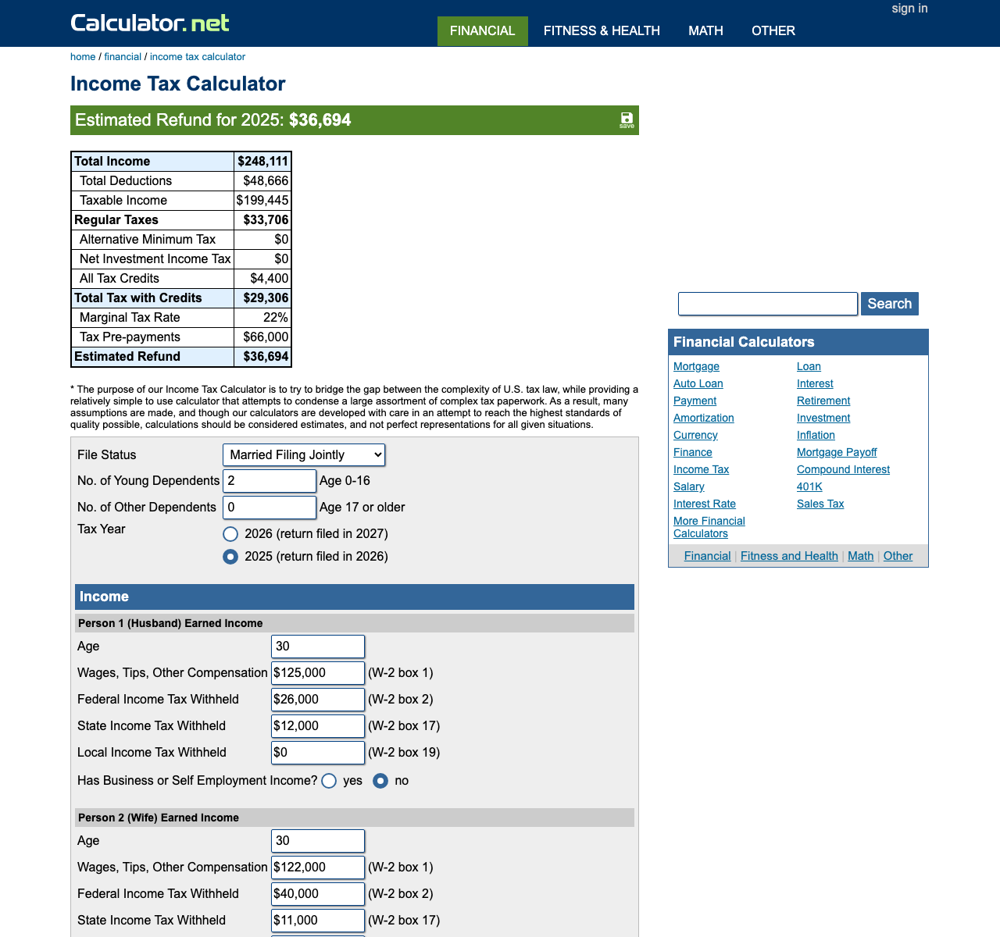

**Privacy Risks:**

- Exact income figures visible ($125,000, $122,000)
- Withholding amounts exposed ($26,000, $40,000)
- Deduction details shown (mortgage: $23,444, donations: $2,222)
- Tax liability calculations visible
- State tax amounts revealed

#### Highlighted (PII Detected)

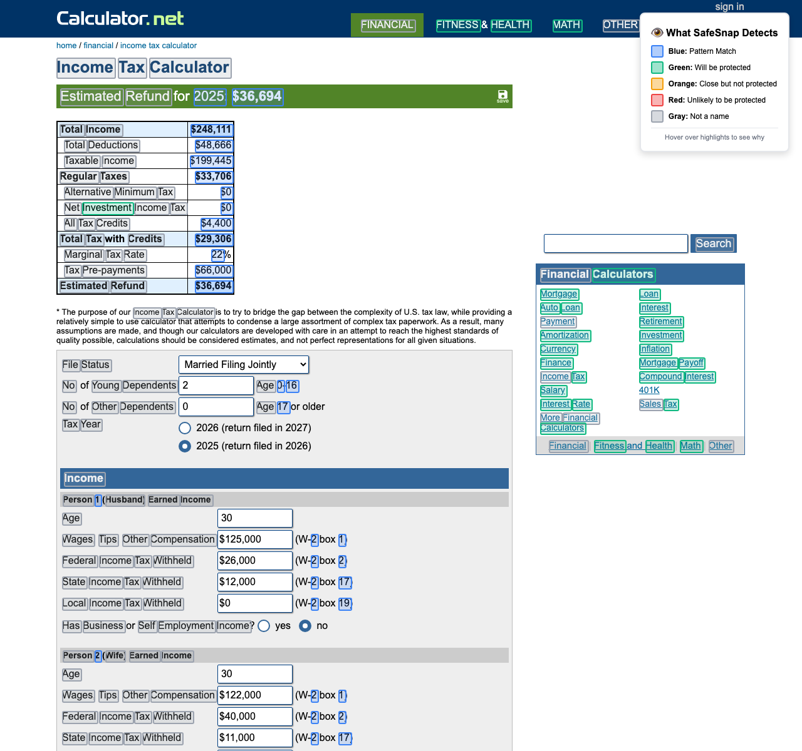

**Detection Applied:**

- All currency values highlighted
- Tax year references detected
- 153 total PII entities identified

#### Protected (PII Replaced)

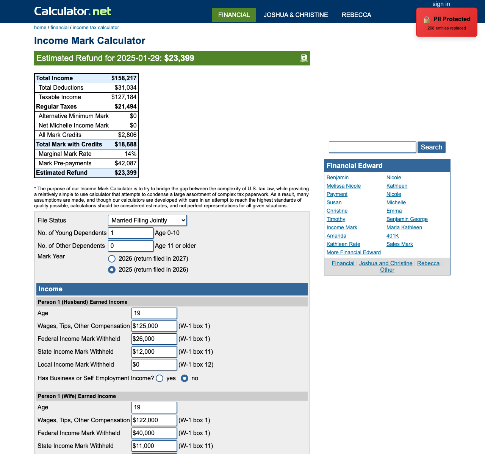

**Protection Applied:**

- All dollar amounts replaced with random values
- Magnitude variance preserves realistic proportions
- Tax years anonymized
- Calculations remain internally consistent (replaced values)

### Sample Replacements

| Original   | Type  | Replacement  |
| ---------- | ----- | ------------ |
| `$125,000` | money | `$70,066`    |
| `$122,000` | money | `$68,385`    |
| `$26,000`  | money | `$14,574`    |
| `$40,000`  | money | `$22,421`    |
| `$100,000` | money | `$56,053`    |
| `$10,000`  | money | `$5,605`     |
| `2025`     | date  | `2025-02-22` |
| `2024`     | date  | `2024-02-22` |

---

## Scenario 3: News Article (SFGate)

**Use Case:** Sharing news articles without exposing location names, dates, or quoted individuals.

**Source:** [SFGate - United Airlines Article](https://www.sfgate.com/travel/article/united-unveiling-most-luxurious-jet-two-major-sfo-21297088.php)

### Detection Summary

| PII Type     | Count   | Examples                                                 |
| ------------ | ------- | -------------------------------------------------------- |
| Locations    | 61      | `California` → `Harborview`, `Bay Area` → `Crystal Lake` |
| Proper Nouns | 130     | Company names, quoted sources                            |
| Dates        | 17      | Publication dates, event dates                           |
| **Total**    | **208** |                                                          |

### Screenshots

#### Original (Before SafeSnap)


**Privacy Risks:**

- Geographic locations mentioned (San Francisco, Bay Area, California)
- Company names visible (United Airlines, Peet's Coffee)
- Dates reveal timeline of events
- Names of quoted individuals exposed

#### Highlighted (PII Detected)

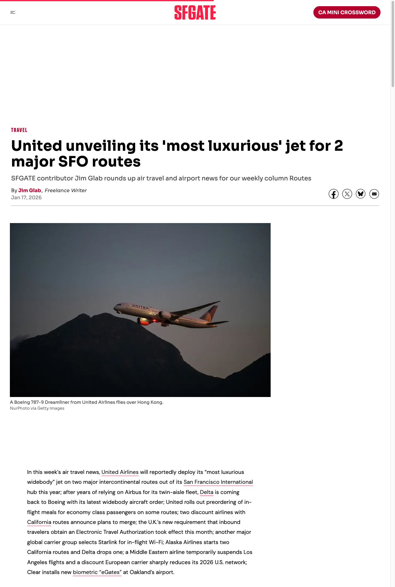

**Detection Applied:**

- Location names highlighted throughout article
- Company and proper nouns identified
- Date references detected
- 208 total PII entities identified

#### Protected (PII Replaced)


**Protection Applied:**

- All location names replaced with fictional places
- Company names anonymized
- Dates replaced while preserving format
- Article remains readable with context preserved

#### Protected with Highlights

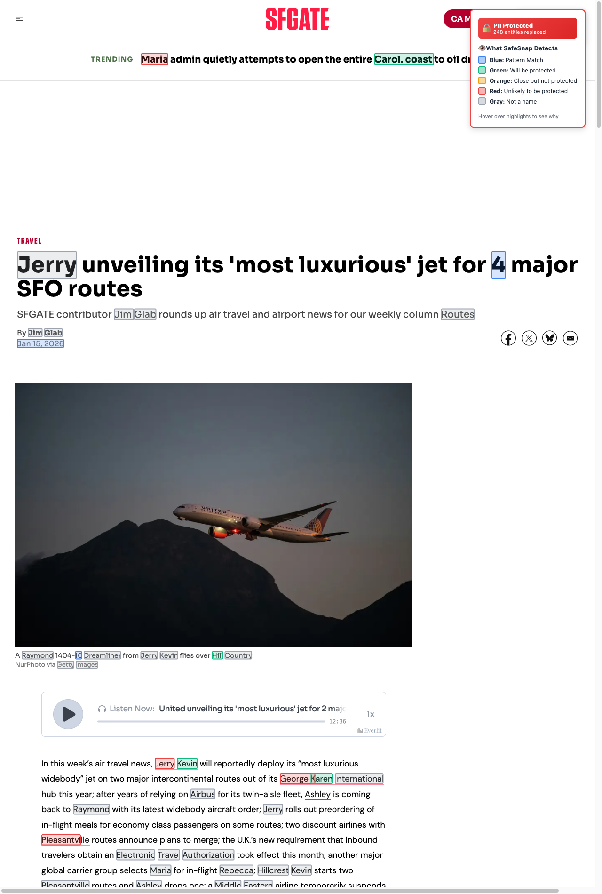

**Verification Mode:**

- Shows protected content WITH highlight overlays
- Useful for verifying what was replaced
- Highlights indicate replaced text positions

### Sample Replacements

| Original     | Type     | Replacement    |
| ------------ | -------- | -------------- |
| `California` | location | `Harborview`   |
| `Bay Area`   | location | `Crystal Lake` |
| `Alaska`     | location | `Oakmont`      |
| `Atlanta`    | location | `Clearview`    |
| `Auckland`   | location | `Unionville`   |
| `Belgium`    | location | `Jasper Creek` |
| `Brisbane`   | location | `Summerville`  |
| `Brussels`   | location | `Brookside`    |

---

## Scenario 4: Wikipedia Article (Blackout Mode)

**Use Case:** Sharing Wikipedia content in blackout mode for complete redaction.

**Source:** [Wikipedia - San Francisco](https://en.wikipedia.org/wiki/San_Francisco)

### Detection Summary

| PII Type     | Count     | Examples                                  |
| ------------ | --------- | ----------------------------------------- |
| Locations    | 1,384     | San Francisco, California, Bay Area, etc. |
| Dates        | 1,225     | Historical dates, years, timelines        |
| Proper Nouns | 5         | Select named entities                     |
| **Total**    | **2,614** |                                           |

### Screenshots

#### Original (Before SafeSnap)

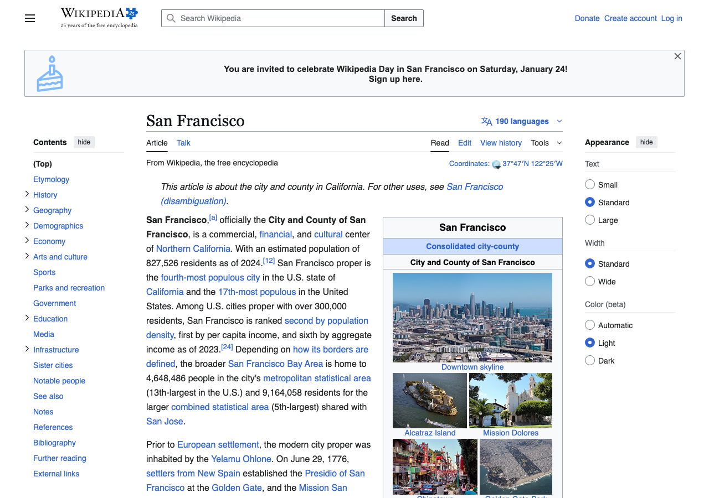

**Content visible:**

- Full Wikipedia article about San Francisco
- Geographic references throughout
- Historical dates and timelines
- Named individuals and organizations

#### Highlighted (PII Detected)

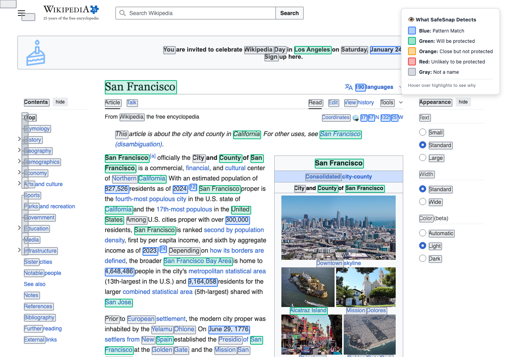

**Detection Applied:**

- Extensive location detection (1,384 instances)
- Historical date detection (1,225 instances)
- High-confidence proper noun filtering (sensitivity: 0.95)
- 2,614 total PII entities identified

#### Protected (Blackout Mode)

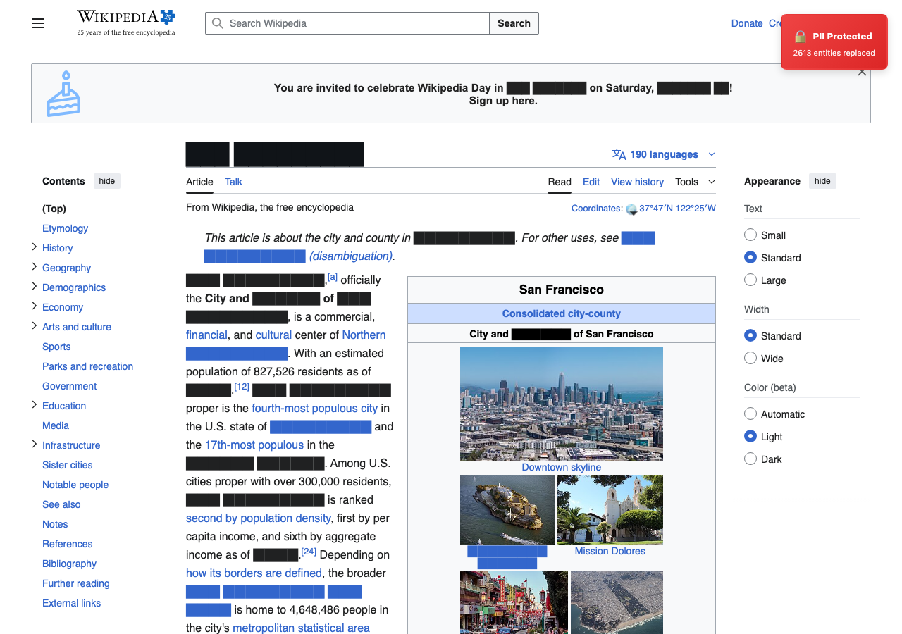

**Blackout Mode Applied:**

- Uses `protectionMode: 'blackout'` instead of random replacement
- All detected PII is completely redacted
- Black boxes replace sensitive text
- Useful when you need complete anonymization rather than realistic fake data

### Blackout vs Random Mode

| Feature     | Random Mode                   | Blackout Mode                    |
| ----------- | ----------------------------- | -------------------------------- |
| Output      | Fake realistic data           | Black redaction boxes            |
| Readability | High (text flows naturally)   | Lower (visible gaps)             |
| Use case    | Demos, presentations          | Legal, compliance                |
| Example     | `San Francisco` → `Clearview` | `San Francisco` → `████████████` |

---

## Key Features Demonstrated

### Protection Modes

| Mode         | Description                             | Use Case                               |
| ------------ | --------------------------------------- | -------------------------------------- |
| **Random**   | Replaces PII with realistic fake data   | Demos, presentations, sharing examples |
| **Blackout** | Completely redacts PII with black boxes | Legal compliance, maximum privacy      |

### Consistency

SafeSnap maintains replacement consistency within a session:

- Same input → Same output (e.g., all instances of `$1,399,000` become the same replacement)
- Magnitude variance is applied consistently across all values

### Detection Sensitivity

The `properNounSensitivity` setting controls false positive trade-offs:

- **Higher (0.9-0.95)** = Fewer false positives, may miss some names
- **Lower (0.5-0.7)** = Catches more names, but may flag UI labels

---

**Last Updated:** January 21, 2026  
**Screenshots Generated By:** [E2E Test Suite](../TESTING.md#e2e-screenshot-scenarios)
